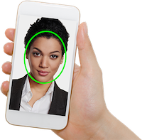

Applied Recognition is a key supplier of face recognition technology for time and attendance kiosks and KYC applications.

# Ver&#8209;ID&nbsp;SDK

Applied Recognition's flagship product is the Ver-ID SDK for iOS and Android. The SDK includes libraries for face detection, face recognition and spoof detection.

To get started, check out one of the sample applications below.

# Biometric sign-in

Capture a face and register it under a user’s name. Once registered, the user can sign in to the app using their face.

- [iOS sample app](https://github.com/AppliedRecognition/Ver-ID-Registry-Demo-Apple)
- [Android sample app](https://github.com/AppliedRecognition/Ver-ID-Registry-Android)

Uses the following Ver-ID libraries:

- Face capture: [iOS](https://github.com/AppliedRecognition/Face-Capture-Apple), [Android](https://github.com/AppliedRecognition/Face-Capture-Android)
- Face detection RetinaFace: [iOS](https://github.com/AppliedRecognition/Face-Detection-RetinaFace-Apple), [Android](https://github.com/AppliedRecognition/Face-Detection-RetinaFace-Android)
- Face recognition ArcFace: [iOS](https://github.com/AppliedRecognition/Face-Recognition-ArcFace-Apple), [Android](https://github.com/AppliedRecognition/Face-Recognition-ArcFace-Android)
- Spoof device detection: [iOS](https://github.com/AppliedRecognition/Spoof-Device-Detection-Ver-ID-3-Apple), [Android](https://github.com/AppliedRecognition/Spoof-Device-Detection-Ver-ID-3-Android)
- Face template registry: [iOS](https://github.com/AppliedRecognition/Face-Template-Registry-Apple), [Android](https://github.com/AppliedRecognition/Face-Template-Registry-Android)

# Identity verification/KYC

Compare a face from a machine-readable travel document to a selfie.

- [iOS sample app](https://github.com/AppliedRecognition/Passport-Reader-iOS)
- [Android sample app](https://github.com/AppliedRecognition/Passport-Reader-Android)

Uses the following Ver-ID libraries:

- Face capture: [iOS](https://github.com/AppliedRecognition/Face-Capture-Apple), [Android](https://github.com/AppliedRecognition/Face-Capture-Android)
- Face detection RetinaFace: [iOS](https://github.com/AppliedRecognition/Face-Detection-RetinaFace-Apple), [Android](https://github.com/AppliedRecognition/Face-Detection-RetinaFace-Android)
- Face recognition ArcFace: [iOS](https://github.com/AppliedRecognition/Face-Recognition-ArcFace-Apple), [Android](https://github.com/AppliedRecognition/Face-Recognition-ArcFace-Android)
- Spoof device detection: [iOS](https://github.com/AppliedRecognition/Spoof-Device-Detection-Ver-ID-3-Apple), [Android](https://github.com/AppliedRecognition/Spoof-Device-Detection-Ver-ID-3-Android)
- MRTD reader: [Android]()